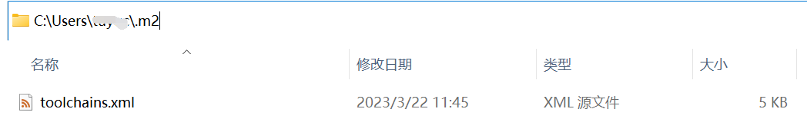
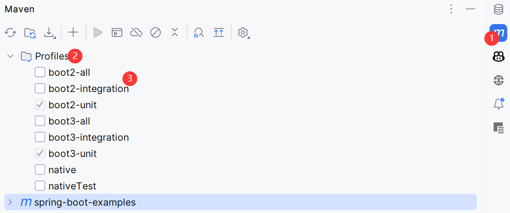

Spring Boot Examples
==============


[](https://raw.githubusercontent.com/tu-yucheng/spring-boot-examples/master/LICENSE.md)
[](https://sonarcloud.io/project/overview?id=tu-yucheng_spring-boot-examples)
[](https://sonarcloud.io/dashboard?id=tu-yucheng_spring-boot-examples)
[](https://sonarcloud.io/summary/new_code?id=tu-yucheng_spring-boot-examples)
[](#contributors)

这个项目是Spring Boot的一个教程，它包含了Spring Boot的各种示例。其中Spring Boot 2示例和Spring Boot 3示例通过Maven Profiles进行隔离。

## 多版本JDK构建

就目前而言，大多数模块都是基于JDK 8/17和Spring Boot 2.7.5构建和运行。此外，还有一些项目是基于JDK 17/19和Spring Boot 3.0.2构建的。我们通过Maven ToolChains工具来保证这些模块能够使用单独的JDK构建。

首先，你需要同时下载这些版本(8、17、19)的JDK。然后配置Maven ToolChains，在你用户目录下的.m2文件夹中添加一个toolchains.xml文件：



然后指定以下内容(务必将每个版本的<jdkHome\>指向你本地该JDK版本的位置，例如D:\\\xxx\\\jdk-17)：

```xml
<?xml version="1.0" encoding="UTF-8"?>
<toolchains xmlns="http://maven.apache.org/TOOLCHAINS/1.1.0" xmlns:xsi="http://www.w3.org/2001/XMLSchema-instance"
            xsi:schemaLocation="http://maven.apache.org/TOOLCHAINS/1.1.0 http://maven.apache.org/xsd/toolchains-1.1.0.xsd">
    <toolchain>
        <type>jdk</type>
        <provides>
            <version>17</version>
            <vendor>adopt</vendor>
        </provides>
        <configuration>
            <jdkHome>your jdk 17 path</jdkHome>
        </configuration>
    </toolchain>
    <toolchain>
        <type>jdk</type>
        <provides>
            <version>8</version>
            <vendor>adopt</vendor>
        </provides>
        <configuration>
            <jdkHome>your jdk 8 path</jdkHome>
        </configuration>
    </toolchain>
    <toolchain>
        <type>jdk</type>
        <provides>
            <version>19</version>
            <vendor>adopt</vendor>
        </provides>
        <configuration>
            <jdkHome>your jdk 19 path</jdkHome>
        </configuration>
    </toolchain>
</toolchains>
```

## Maven Profiles

我们使用Maven Profile来隔离Spring Boot 2和3模块列表，这些项目大致分为：boot2(Spring Boot 2)、boot3(Spring Boot 3)。接下来，根据我们要执行的测试进一步隔离它们：

|      Profile      |       包含        |           启用的测试类型           |
|:-----------------:|:---------------:|:---------------------------:|
|    boot2-unit     | Spring Boot 2项目 |          *UnitTest          |
| boot2-integration | Spring Boot 2项目 |      *IntegrationTest       |
|     boot2-all     | Spring Boot 2项目 | *IntegrationTest、\*UnitTest |
|    boot3-unit     | Spring Boot 3项目 |          *UnitTest          |
| boot3-integration | Spring Boot 3项目 |      *IntegrationTest       |
|     boot3-all     | Spring Boot 3项目 | *IntegrationTest、\*UnitTest |

## 构建项目

尽管不需要经常一次构建整个仓库，因为我们通常关注特定的模块。

但是，如果我们想在仅启用单元测试的情况下构建整个仓库，我们可以从仓库的根目录调用以下命令：

```shell
mvn clean install -Pboot2-unit,boot3-unit
```

或者，如果我们想在启用集成测试的情况下构建整个仓库，我们可以执行以下操作：

```shell
mvn clean install -Pboot2-integration,boot3-integration
```

## 构建单个模块

要构建特定模块，请在模块目录中运行命令：

```shell
mvn clean install
```

## 运行Spring Boot模块

要运行Spring Boot模块，请在模块目录中运行命令：

```shell
mvn spring-boot:run
```

## 导入到IDE

此仓库包含大量模块，当你使用单个模块时，无需导入所有模块(或构建所有模块)-你可以只需在Eclipse或IntelliJ中导入该特定模块即可。

当你将项目导入到Intellij IDEA中时，默认不会加载任何子模块。你需要在IDE中转到Maven -> Profiles，然后选择你想要构建的子模块所属的Profile，最后刷新等待IDE索引构建完成：



## 运行测试

模块中的命令`mvn clean install`将运行该模块中的单元测试，这也将运行`SpringContextTest`(如果存在)。

要同时运行单元和集成测试，请使用以下命令：

```shell
mvn clean install -Pboot2-all
```
或者

```shell
mvn clean install -Pboot3-all
```

取决于我们的模块所在的列表。

## 模块列表

+ [Spring Boot 3](spring-boot-3/README.md)
+ [Spring Boot 3 Native](spring-boot-3-native/README.md)
+ [Spring Boot Actuator](spring-boot-actuator/README.md)
+ [Spring Boot Admin](spring-boot-admin/README.md)
+ [Spring Boot Angular](spring-boot-angular/README.md)
+ [Spring Boot Annotations](spring-boot-annotations-1/README.md)
+ [Spring Boot Artifacts](spring-boot-artifacts-1/README.md)
+ [Spring Boot AutoConfiguration](spring-boot-autoconfiguration/README.md)
+ [Spring Boot AWS](spring-boot-aws/README.md)
+ [Spring Boot Bootstrap](spring-boot-bootstrap/README.md)
+ [Spring Boot Customization](spring-boot-basic-customization-1/README.md)
+ [Spring Boot Caching](spring-boot-caching-1/README.md)
+ [Spring Boot Cassandre](spring-boot-cassandre/README.md)
+ [Spring Boot CI/CD](spring-boot-ci-cd/README.md)
+ [Spring Boot CLI](spring-boot-cli/README.md)
+ [Spring Boot Client](spring-boot-client/README.md)
+ [Spring Boot Config JPA Error](spring-boot-config-jpa-error/README.md)
+ [Spring Boot CRUD](spring-boot-crud/README.md)
+ [Spring Boot Context Fluent](spring-boot-ctx-fluent/README.md)
+ [Spring Boot Custom Starter](spring-boot-custom-starter/README.md)
+ [Spring Boot Data](spring-boot-data-1/README.md)
+ [Spring Boot Deployment](spring-boot-deployment/README.md)
+ [Spring Boot DI](spring-boot-di/README.md)
+ [Spring Boot Disable Logging](spring-boot-disable-logging/README.md)
+ [Spring Boot Environment](spring-boot-environment/README.md)
+ [Spring Boot Exception](spring-boot-exceptions/README.md)
+ [Spring Boot Flowable](spring-boot-flowable/README.md)
+ [Spring Boot Gradle](spring-boot-gradle/README.md)
+ [Spring Boot GraphQL](spring-boot-graphql/README.md)
+ [Spring Boot Groovy](spring-boot-groovy/README.md)
+ [Spring Boot Jasypt](spring-boot-jasypt/README.md)
+ [Spring Boot JSP](spring-boot-jsp/README.md)
+ [Spring Boot Keycloak Adapters](spring-boot-keycloak-adapters/README.md)
+ [Spring Boot Keycloak](spring-boot-keycloak-1/README.md)
+ [Spring Boot Library](spring-boot-libraries-1/README.md)
+ [Spring Boot Log4j2](spring-boot-logging-log4j2/README.md)
+ [Spring Boot Logback](spring-boot-logging-logback/README.md)
+ [Spring Boot MVC](spring-boot-mvc-1/README.md)
+ [Spring Boot MVC Birt](spring-boot-mvc-birt/README.md)
+ [Spring Boot MVC Jersey](spring-boot-mvc-jersey/README.md)
+ [Spring Boot Nashorn](spring-boot-nashorn/README.md)
+ [Spring Boot Parent](spring-boot-parent/README.md)
+ [Spring Boot Performance](spring-boot-performance/README.md)
+ [Spring Boot Process Automation](spring-boot-process-automation/README.md)
+ [Spring Boot Properties](spring-boot-properties-1/README.md)
+ [Spring Boot React](spring-boot-react/README.md)
+ [Spring Boot Redis](spring-boot-redis/README.md)
+ [Spring Boot Request Params](spring-boot-request-params/README.md)
+ [Spring Boot Runtime](spring-boot-runtime-1/README.md)
+ [Spring Boot Security](spring-boot-security/README.md)
+ [Spring Boot SpringDoc](spring-boot-springdoc/README.md)
+ [Spring Boot Swagger](spring-boot-swagger-1/README.md)
+ [Spring Boot Testing](spring-boot-testing-1/README.md)
+ [Spring Boot Validation](spring-boot-validation/README.md)
+ [Spring Boot Vue](spring-boot-vue/README.md)

## 贡献人员

<!-- ALL-CONTRIBUTORS-LIST:START - Do not remove or modify this section -->
<!-- prettier-ignore-start -->
<!-- markdownlint-disable -->
<table>
  <tr>
    <td align="center"><a href="https://github.com/tu-yucheng"><br /><sub><b>tuyucheng</b></sub></a><br /><a href="#projectManagement-tuyucheng" title="Project Management">📆</a> <a href="#maintenance-tuyucheng" title="Maintenance">🚧</a> <a href="#content-tuyucheng" title="Content">🖋</a></td>
    <td align="center"><a href="https://github.com/take-today"><br /><sub><b>taketoday</b></sub></a><br /><a href="#content-taketoday" title="Content">🖋</a></td>
  </tr>
</table>