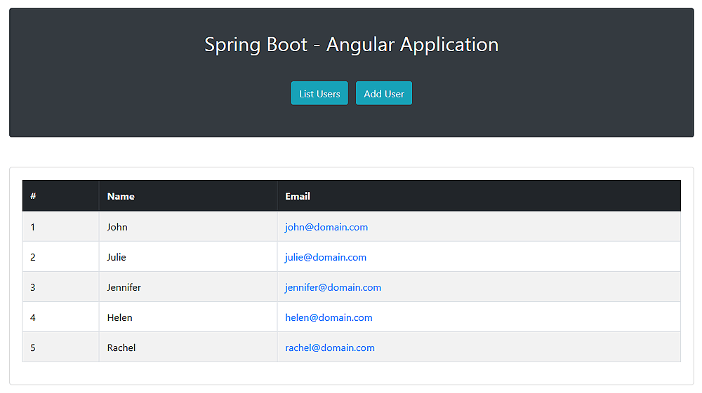
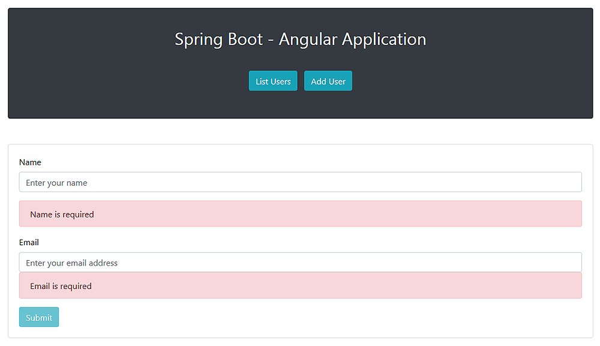

## 1. 概述

[Spring Boot](https://www.baeldung.com/spring-boot)和[Angular](https://angular.io/)形成了一个强大的组合，非常适合开发占用空间最小的Web应用程序。

在本教程中，**我们将使用[Spring Boot](https://www.baeldung.com/spring-boot)实现RESTful后端，并使用[Angular](https://angular.io/)创建基于JavaScript的前端**。

## 延伸阅读

### [Spring中的接口驱动控制器](https://www.baeldung.com/spring-interface-driven-controllers)

了解如何在Java接口上使用Spring MVC请求注解创建控制器。

[阅读更多](https://www.baeldung.com/spring-interface-driven-controllers)→

### [Spring REST API + OAuth2 + Angular](https://www.baeldung.com/rest-api-spring-oauth2-angular)

了解如何使用Spring Security 5为Spring REST API设置OAuth2，以及如何从Angular客户端使用它。

[阅读更多](https://www.baeldung.com/rest-api-spring-oauth2-angular)→

## 2. Spring Boot应用程序

我们的演示Web应用程序的功能确实非常简单。它将缩小到从内存中的[H2数据库](https://www.baeldung.com/java-in-memory-databases)中获取和显示JPA实体列表，并通过纯HTML表单持久化新实体。

### 2.1 Maven依赖项

这是我们的Spring Boot项目的依赖项：

```xml
<dependency>
    <groupId>org.springframework.boot</groupId>
    <artifactId>spring-boot-starter-web</artifactId>
</dependency>
<dependency>
    <groupId>org.springframework.boot</groupId>
    <artifactId>spring-boot-starter-data-jpa</artifactId>
</dependency>
<dependency>
    <groupId>com.h2database</groupId>
    <artifactId>h2</artifactId>
    <scope>runtime</scope>
</dependency>
```

请注意，我们包含了[spring-boot-starter-web](https://central.sonatype.com/artifact/org.springframework.boot/spring-boot-starter-web/3.0.3)，因为我们将使用它来创建REST服务，并使用[spring-boot-starter-jpa](https://central.sonatype.com/artifact/org.springframework.boot/spring-boot-starter-data-jpa/3.0.3)来实现持久层。

[H2数据库](https://central.sonatype.com/artifact/com.h2database/h2/2.1.212)版本也由Spring Boot Parent管理。

### 2.2 JPA实体类

为了快速构建我们应用程序域层的原型，让我们定义一个简单的JPA实体类，它将负责对用户进行建模：

```java
@Entity
public class User {

    @Id
    @GeneratedValue(strategy = GenerationType.AUTO)
    private long id;
    private final String name;
    private final String email;

    // standard constructors / setters / getters / toString
}
```

### 2.3 UserRepository接口

由于我们需要User实体上的基本CRUD功能，因此我们还必须定义一个UserRepository接口：

```java
@Repository
public interface UserRepository extends CrudRepository<User, Long>{}
```

### 2.4 REST控制器

现在让我们实现REST API。在这种情况下，它只是一个简单的REST控制器：

```java
@RestController
@CrossOrigin(origins = "http://localhost:4200")
public class UserController {

    // standard constructors

    private final UserRepository userRepository;

    @GetMapping("/users")
    public List<User> getUsers() {
        return (List<User>) userRepository.findAll();
    }

    @PostMapping("/users")
    void addUser(@RequestBody User user) {
        userRepository.save(user);
    }
}
```

UserController类的定义本身并不复杂。

当然，这里值得注意的实现细节是**[@CrossOrigin](https://docs.spring.io/spring-framework/docs/current/javadoc-api/org/springframework/web/bind/annotation/CrossOrigin.html)注解的使用**。顾名思义，注解在服务器上启用[跨源资源共享(CORS)](https://www.baeldung.com/spring-cors)。

**此步骤并不总是必要的**，但由于我们将Angular前端部署到[http://localhost:4200](http://localhost:4200/)，而我们的Boot后端部署到[http://localhost:8080](http://localhost:8080/)，**否则浏览器会拒绝从一个到另一个的请求**。

关于控制器方法，getUser()从数据库中获取所有用户实体。类似地，addUser()方法在数据库中持久化一个新实体，该实体在[请求正文](https://www.baeldung.com/spring-request-response-body)中传递。

为了简单起见，我们故意省略了在持久化实体之前触发[Spring Boot验证](https://www.baeldung.com/spring-boot-bean-validation)的控制器实现。但是，在生产中，我们不能单独信任用户输入，因此服务器端验证应该是一项强制性功能。

### 2.5 引导Spring Boot应用程序

最后，让我们创建一个标准的Spring Boot启动类，并使用一些用户实体填充数据库：

```java
@SpringBootApplication
public class Application {

    public static void main(String[] args) {
        SpringApplication.run(Application.class, args);
    }

    @Bean
    CommandLineRunner init(UserRepository userRepository) {
        return args -> {
            Stream.of("John", "Julie", "Jennifer", "Helen", "Rachel").forEach(name -> {
                User user = new User(name, name.toLowerCase() + "@domain.com");
                userRepository.save(user);
            });
            userRepository.findAll().forEach(System.out::println);
        };
    }
}
```

现在让我们运行应用程序。正如预期的那样，我们应该在启动时看到打印到控制台的用户实体列表：

```shell
User{id=1, name=John, email=john@domain.com}
User{id=2, name=Julie, email=julie@domain.com}
User{id=3, name=Jennifer, email=jennifer@domain.com}
User{id=4, name=Helen, email=helen@domain.com}
User{id=5, name=Rachel, email=rachel@domain.com}
```

## 3. Angular应用程序

随着我们的演示Spring Boot应用程序启动并运行，我们现在可以创建一个能够使用REST控制器API的简单Angular应用程序。

### 3.1 Angular CLI安装

我们将使用强大的命令行实用程序[Angular CLI](https://cli.angular.io/)来创建我们的Angular应用程序。

Angular CLI是一个非常有价值的工具，因为**它允许我们从头开始创建整个Angular项目，只需几个命令即可生成组件、服务、类和接口**。

一旦我们安装了[npm](https://www.npmjs.com/)(Node包管理器)，我们就可以打开一个命令控制台并键入命令：

```shell
npm install -g @angular/cli@1.7.4
```

就是这样。上面的命令将安装最新版本的Angular CLI。

### 3.2 使用Angular CLI搭建项目脚手架

我们可以从头开始生成我们的Angular应用程序结构，但老实说，这是一个容易出错且耗时的任务，我们在所有情况下都应该避免。

相反，我们会让Angular CLI为我们完成这些繁重的工作。因此我们可以打开一个命令控制台，然后导航到要在其中创建应用程序的文件夹，然后键入命令：

```shell
ng new angularclient
```

new命令将在angularclient目录中生成整个应用程序结构。

### 3.3 Angular应用程序的入口点

如果我们查看angularclient文件夹，我们会看到Angular CLI有效地为我们创建了一个完整的项目。

**Angular的应用程序文件使用[TypeScript](https://www.typescriptlang.org/)，它是一种类型化的JavaScript超集，可以编译为纯JavaScript**。但是，任何Angular应用程序的入口点都是一个普通的旧index.html文件。

让我们编辑这个文件：

```html
<!doctype html>
<html lang="en">
<head>
    <meta charset="utf-8">
    <title>Spring Boot - Angular Application</title>
    <base href="/">
    <meta name="viewport" content="width=device-width, initial-scale=1">
    <link rel="icon" type="image/x-icon" href="favicon.ico">
    <link rel="stylesheet"
          href="https://maxcdn.bootstrapcdn.com/bootstrap/4.0.0/css/bootstrap.min.css"
          integrity="sha384-Gn5384xqQ1aoWXA+058RXPxPg6fy4IWvTNh0E263XmFcJlSAwiGgFAW/dAiS6JXm"
          crossorigin="anonymous">
</head>
<body>
<app-root></app-root>
</body>
</html>
```

正如我们在上面看到的，我们包含了[Bootstrap 4](https://getbootstrap.com/)，这样我们就可以让我们的应用程序UI组件看起来更漂亮。当然，可以从现有的一堆UI工具包中挑选另一个UI工具包。

请注意<body\>部分中的自定义<app-root\></app-root\>标签。乍一看，它们看起来很奇怪，因为<app-root\>不是标准的HTML 5元素。

我们将它们保留在那里，因为**<app-root\>是Angular用于呈现应用程序根组件的根选择器**。

### 3.4 app.component.ts根组件

为了更好地理解Angular如何将HTML模板绑定到组件，让我们进入src/app目录并编辑根组件app.component.ts TypeScript文件：

```typescript
import {Component} from '@angular/core';

@Component({
    selector: 'app-root',
    templateUrl: './app.component.html',
    styleUrls: ['./app.component.css']
})
export class AppComponent {

    title: string;

    constructor() {
        this.title = 'Spring Boot - Angular Application';
    }
}
```

出于显而易见的原因，我们不会深入研究TypeScript。即便如此，我们还是要注意该文件定义了一个AppComponent类，该类声明了一个字符串类型(小写)的字段title。毫无疑问，它是类型化的JavaScript。

此外，构造函数使用字符串值初始化该字段，这与我们在Java中所做的非常相似。

最相关的部分是**@Component元数据标记或装饰器**，它定义了三个元素：

1.  selector：用于将组件绑定到HTML模板文件的HTML选择器
2.  templateUrl：与组件关联的HTML模板文件
3.  styleUrls：与组件关联的一个或多个CSS文件

正如预期的那样，我们可以使用app.component.html和app.component.css文件来定义根组件的HTML模板和CSS样式。

最后，selector元素将整个组件绑定到包含在index.html文件中的<app-root\>选择器。

### 3.5 app.component.html文件

由于app.component.html文件允许我们**定义根组件的HTML模板**，即AppComponent类，我们将使用它来创建带有两个按钮的基本导航栏。

如果我们单击第一个按钮，Angular将显示一个表，其中包含存储在数据库中的用户实体列表。类似地，如果我们单击第二个按钮，它将呈现一个HTML表单，我们可以使用它向数据库添加新实体：

```html
<div class="container">
    <div class="row">
        <div class="col-md-12">
            <div class="card bg-dark my-5">
                <div class="card-body">
                    <h2 class="card-title text-center text-white py-3">{{ title }}</h2>
                    <ul class="text-center list-inline py-3">
                        <li class="list-inline-item">
                            <a routerLink="/users" class="btn btn-info">List Users</a>
                        </li>
                        <li class="list-inline-item">
                            <a routerLink="/adduser" class="btn btn-info">Add User</a>
                        </li>
                    </ul>
                </div>
            </div>
            <router-outlet></router-outlet>
        </div>
    </div>
</div>
```

该文件的大部分是标准HTML，有一些值得注意的注意事项。

**第一个是{{title}}表达式。双花括号{{variable-name}}是Angular用于执行变量插值的占位符**。

请记住，AppComponent类使用值Spring Boot – Angular Application初始化了title字段。因此，Angular将在模板中显示该字段的值。同样，更改构造函数中的值将反映在模板中。

**第二个要注意的是routerLink属性**。

**Angular使用此属性通过其路由模块路由请求**(稍后会详细介绍)。现在，知道模块将向/users路径的请求分派到特定组件并将向/adduser的请求分派到另一个组件就足够了。

在每种情况下，与匹配组件关联的HTML模板将在<router-outlet\></router-outlet\>占位符内呈现。

### 3.6 用户类

由于我们的Angular应用程序将从数据库中获取用户实体并将其持久化，因此让我们使用TypeScript实现一个简单的域模型。

让我们打开一个终端控制台并创建一个model目录：

```shell
ng generate class user
```

Angular CLI将生成一个空的User类，因此让我们用几个字段填充它：

```typescript
export class User {
    id: string;
    name: string;
    email: string;
}
```

### 3.7 UserService服务

在我们的客户端域User类已经设置的情况下，我们现在可以实现一个服务类，该服务类对[http://localhost:8080/users](http://localhost:8080/users)端点执行GET和POST请求。

**这将允许我们将对REST控制器的访问封装在一个类中，我们可以在整个应用程序中重复使用它**。

让我们打开一个控制台终端，然后创建一个service目录，并在该目录中键入以下命令：

```shell
ng generate service user-service
```

现在让我们打开Angular CLI刚刚创建的user.service.ts文件并重构它：

```typescript
import { Injectable } from '@angular/core';
import { HttpClient, HttpHeaders } from '@angular/common/http';
import { User } from '../model/user';
import { Observable } from 'rxjs/Observable';

@Injectable()
export class UserService {

    private usersUrl: string;

    constructor(private http: HttpClient) {
        this.usersUrl = 'http://localhost:8080/users';
    }

    public findAll(): Observable<User[]> {
        return this.http.get<User[]>(this.usersUrl);
    }

    public save(user: User) {
        return this.http.post<User>(this.usersUrl, user);
    }
}
```

我们不需要扎实的TypeScript背景知识来理解UserService类的工作原理。简而言之，它将使用我们之前**在Spring Boot中实现的REST控制器API所需的所有功能封装在一个可重用组件中**。

findAll()方法通过[Angular的HttpClient](https://angular.io/guide/http)向[http://localhost:8080/users](http://localhost:8080/users)端点执行GET HTTP请求。该方法返回一个包含User对象数组的[Observable](https://angular.io/guide/observables)实例。

同样，save()方法对[http://localhost:8080/users](http://localhost:8080/users)端点执行POST HTTP请求。

通过在HttpClient的请求方法中指定User类型，我们可以以更简单、更有效的方式使用后端响应。

最后，让我们**注意[@Injectable()](https://angular.io/api/core/Injectable)元数据标记的使用。这表明服务应该通过[Angular的依赖注入器](https://angular.io/guide/dependency-injection)创建和注入**。

### 3.8 UserListComponent组件

在这种情况下，UserService类是REST服务和应用程序表示层之间的薄中间层。因此，我们需要定义一个组件，负责呈现保存在数据库中的User实体列表。

让我们打开一个终端控制台，然后创建一个user-list目录，并生成一个用户列表组件：

```shell
ng generate component user-list
```

Angular CLI将生成一个空的组件类，它实现了[ngOnInit](https://angular.io/api/core/OnInit)接口。该接口声明了一个钩子ngOnInit()方法，Angular在完成实例化实现类之后以及调用其构造函数之后调用该方法。

让我们重构这个类，以便它可以在构造函数中获取一个UserService实例：

```typescript
import { Component, OnInit } from '@angular/core';
import { User } from '../model/user';
import { UserService } from '../service/user.service';

@Component({
    selector: 'app-user-list',
    templateUrl: './user-list.component.html',
    styleUrls: ['./user-list.component.css']
})
export class UserListComponent implements OnInit {

    users: User[];

    constructor(private userService: UserService) {
    }

    ngOnInit() {
        this.userService.findAll().subscribe(data => {
            this.users = data;
        });
    }
}
```

UserListComponent类的实现是不言自明的。它只是使用UserService的findAll()方法来获取数据库中持久保存的所有实体并将它们存储在users字段中。

此外，我们需要编辑组件的HTML文件user-list.component.html，以创建显示实体列表的表格：

```html
<div class="card my-5">
    <div class="card-body">
        <table class="table table-bordered table-striped">
            <thead class="thead-dark">
            <tr>
                <th scope="col">#</th>
                <th scope="col">Name</th>
                <th scope="col">Email</th>
            </tr>
            </thead>
            <tbody>
            <tr *ngFor="let user of users">
                <td>{{ user.id }}</td>
                <td>{{ user.name }}</td>
                <td><a href="mailto:{{ user.email }}">{{ user.email }}</a></td>
            </tr>
            </tbody>
        </table>
    </div>
</div>
```

**我们应该注意[*ngFor](https://angular.io/guide/structural-directives)指令的使用**。该指令称为repeater，我们可以使用它来迭代变量的内容并迭代地呈现HTML元素。在本例中，我们使用它来动态呈现表的行。

此外，我们使用变量插值来显示每个用户的id、name和email。

### 3.9 UserFormComponent组件

同样，我们需要创建一个组件，允许我们在数据库中持久化一个新的User对象。

让我们创建一个user-form目录并键入以下内容：

```shell
ng generate component user-form
```

接下来让我们打开user-form.component.ts文件，并在UserFormComponent类中添加一个保存User对象的方法：

```typescript
import { Component } from '@angular/core';
import { ActivatedRoute, Router } from '@angular/router';
import { UserService } from '../service/user.service';
import { User } from '../model/user';

@Component({
    selector: 'app-user-form',
    templateUrl: './user-form.component.html',
    styleUrls: ['./user-form.component.css']
})
export class UserFormComponent {

    user: User;

    constructor(
            private route: ActivatedRoute,
            private router: Router,
            private userService: UserService) {
        this.user = new User();
    }

    onSubmit() {
        this.userService.save(this.user).subscribe(result => this.gotoUserList());
    }

    gotoUserList() {
        this.router.navigate(['/users']);
    }
}
```

在这种情况下，UserFormComponent还在构造函数中获取一个UserService实例，onSubmit()方法使用该实例来保存提供的User对象。

由于我们需要在持久化新实体后重新显示更新的实体列表，因此我们在插入后调用gotoUserList()方法，它将用户重定向到/users路径。

此外，我们需要编辑user-form.component.html文件，并创建用于在数据库中保存新用户的HTML表单：

```html
<div class="card my-5">
    <div class="card-body">
        <form (ngSubmit)="onSubmit()" #userForm="ngForm">
            <div class="form-group">
                <label for="name">Name</label>
                <input type="text" [(ngModel)]="user.name"
                       class="form-control"
                       id="name"
                       name="name"
                       placeholder="Enter your name"
                       required #name="ngModel">
            </div>
            <div [hidden]="!name.pristine" class="alert alert-danger">Name is required</div>
            <div class="form-group">
                <label for="email">Email</label>
                <input type="text" [(ngModel)]="user.email"
                       class="form-control"
                       id="email"
                       name="email"
                       placeholder="Enter your email address"
                       required #email="ngModel">
                <div [hidden]="!email.pristine" class="alert alert-danger">Email is required</div>
            </div>
            <button type="submit" [disabled]="!userForm.form.valid"
                    class="btn btn-info">Submit</button>
        </form>
    </div>
</div>
```

乍一看，该表单看起来非常标准，但它在幕后封装了Angular的许多功能。

让我们**注意[ngSubmit](https://angular.io/guide/forms)指令的使用，它在提交表单时调用onSubmit()方法**。

接下来我们**定义了模板变量#userForm，因此Angular自动添加了一个[NgForm](https://angular.io/api/forms/NgForm)指令，它允许我们将表单作为一个整体进行跟踪**。

NgForm指令包含我们为带有[ngModel](https://angular.io/api/forms/NgModel)指令和name属性的表单元素创建的控件。它还监视它们的属性，包括它们的状态。

**ngModel指令为我们提供了表单控件和客户端域模型(User类)之间的[双向数据绑定](https://angular.io/guide/template-syntax#ngModel)功能**。

这意味着在表单输入字段中输入的数据将流向模型，反之亦然。两个元素的变化将通过DOM操作立即反映出来。

此外，ngModel允许我们跟踪每个表单控件的状态，并通过向每个控件添加不同的CSS类和DOM属性来执行[客户端验证](https://angular.io/guide/form-validation)。

在上面的HTML文件中，我们使用应用于表单控件的属性仅在表单中的值已更改时显示警告框。

### 3.10 app-routing.module.ts文件

尽管组件是独立运行的，但我们仍然需要使用一种机制在用户单击导航栏中的按钮时调用它们。

这就是[RouterModule](https://angular.io/api/router/RouterModule)发挥作用的地方。让我们打开app-routing.module.ts文件并配置模块，以便它可以将请求分派给匹配的组件：

```typescript
import { NgModule } from '@angular/core';
import { Routes, RouterModule } from '@angular/router';
import { UserListComponent } from './user-list/user-list.component';
import { UserFormComponent } from './user-form/user-form.component';

const routes: Routes = [
    { path: 'users', component: UserListComponent },
    { path: 'adduser', component: UserFormComponent }
];

@NgModule({
    imports: [RouterModule.forRoot(routes)],
    exports: [RouterModule]
})
export class AppRoutingModule { }
```

正如我们在上面看到的，**Routes数组指示路由器在用户单击链接或在浏览器地址栏中指定URL时显示哪个组件**。

路由由两部分组成：

1.  Path：与浏览器地址栏中的URL相匹配的字符串
2.  Component：当路由处于活动状态(导航)时要创建的组件

如果用户单击链接到/users路径的”List Users“按钮，或在浏览器地址栏中输入URL，则路由器将在<router-outlet\>占位符中呈现UserListComponent组件的模板文件。

同样，如果他们单击“Add User”按钮，它将呈现UserFormComponent组件。

### 3.11 app.module.ts文件

接下来我们需要编辑app.module.ts文件，这样Angular就可以导入所有需要的模块、组件和服务。

此外，我们需要指定将用于创建和注入UserService类的提供程序。否则，Angular将无法将其注入到组件类中：

```typescript
import { BrowserModule } from '@angular/platform-browser';
import { NgModule } from '@angular/core';
import { AppRoutingModule } from './app-routing.module';
import { FormsModule } from '@angular/forms';
import { HttpClientModule } from '@angular/common/http';
import { AppComponent } from './app.component';
import { UserListComponent } from './user-list/user-list.component';
import { UserFormComponent } from './user-form/user-form.component';
import { UserService } from './service/user.service';

@NgModule({
    declarations: [
        AppComponent,
        UserListComponent,
        UserFormComponent
    ],
    imports: [
        BrowserModule,
        AppRoutingModule,
        HttpClientModule,
        FormsModule
    ],
    providers: [UserService],
    bootstrap: [AppComponent]
})
export class AppModule { }
```

## 4. 运行应用程序

最后，我们准备运行我们的应用程序。

为此，我们将首先运行Spring Boot应用程序，以便REST服务处于活动状态并监听请求。

启动Spring Boot应用程序后，我们将打开命令控制台并键入以下命令：

```shell
ng serve --open
```

**这将启动Angular的实时开发服务器，并在浏览器打开[http://localhost:4200](http://localhost:4200)**。

我们应该看到带有用于列出现有实体和添加新实体的按钮的导航栏。如果我们点击第一个按钮，我们应该在导航栏下方看到一个表格，其中包含数据库中保存的实体列表：同样，点击第二个按钮将显示用于保存新实体的HTML表单：





## 5. 总结

在本文中，我们学习了如何使用Spring Boot和Angular构建一个基本的Web应用程序。